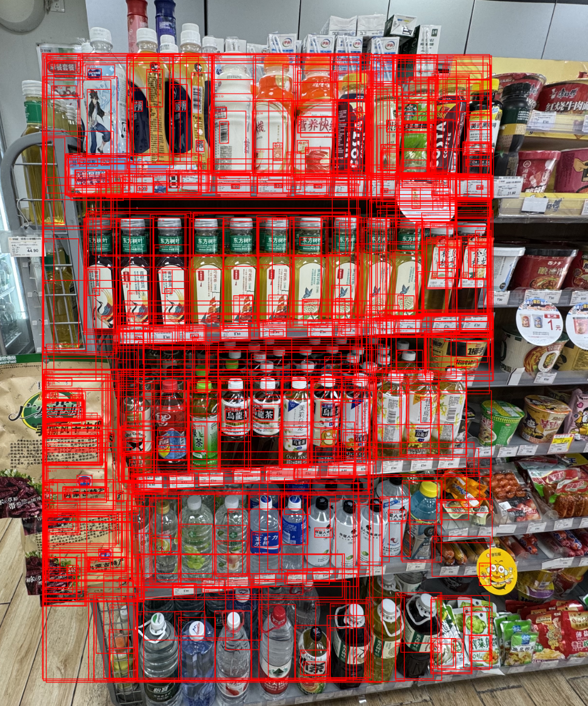

# 人机协作式智能检测平台 (BLIP → 人工修正 → OWLv2 → CLIP)

这是一个先进的、基于多模型协同工作的“以图搜图”智能检测平台。它巧妙地融合了当前最强大的视觉语言模型，并创造性地引入了“人机协作”机制，允许用户在关键环节对AI的判断进行干预和修正，从而极大地提升了检测的准确性、灵活性和鲁棒性。

该项目从一个简单的、基于文本查询的 OWLv2 检测应用出发，经过多次迭代，最终进化为一个集成了 BLIP、OWLv2 和 CLIP 三种模型的复杂协同系统。

**最终形态：一个结合了AI描述、人类智慧、AI定位和AI验证的强大工具。**



## 核心功能与优势

*   **以图搜图检测**: 用户可以上传一张“查询图片”，并框选出感兴趣的物体，然后在另一张“目标图片”中找到这个物体。
*   **人机协作工作流**: 用户可以在AI（BLIP）生成初始描述后，对其进行**手动编辑和修正**，将人类的先验知识和判断力注入到AI工作流中，解决AI描述不准或有偏差的问题。
*   **三模型混合架构**: 充分利用了每个模型的独特优势：
    *   **BLIP**: 负责对用户框选的物体进行“看图说话”，生成精准的**文本描述**。
    *   **OWLv2**: 作为强大的**定位器**，根据BLIP生成（或人类修正）的文本，在目标图片中高效地搜索并定位出候选物体。
    *   **CLIP**: 担当最终的**验证者**，通过计算纯粹的视觉特征相似度，在候选物体中找出与原始查询物体最匹配的结果，确保最终结果的准确性。
*   **动态阈值调整**: 用户可以动态调整两个关键阈值：OWLv2的候选框筛选阈值和最终的CLIP相似度阈值。
*   **实时动态可视化**: 以“赛马”的形式，实时、动态地展示CLIP的验证过程，将模型决策过程直观地呈现给用户。

## 技术栈

*   **后端**: Python 3.10+, Flask
*   **前端**: HTML, CSS, JavaScript, Cropper.js, Server-Sent Events (SSE)
*   **AI 模型**: Hugging Face Transformers
    *   `google/owlv2-base-patch16-ensemble` (定位)
    *   `Salesforce/blip-image-captioning-base` (描述)
    *   `openai/clip-vit-base-patch32` (验证)
*   **核心库**: PyTorch, Pillow

## 安装与运行

### 1. 环境准备

强烈建议使用 `mamba` 或 `conda` 创建一个独立的 Python 虚拟环境。

```bash
# 推荐使用 mamba
mamba create -n owlv2_env python=3.10 -y
mamba activate owlv2_env
```

### 2. 安装依赖

首先，尝试直接通过 `requirements.txt` 文件安装依赖：

```bash
pip install -r requirements.txt
```

--- 

### 🚨 macOS / Apple Silicon 安装故障排除

如果您在安装过程中，遇到关于 `decord` 或 `open3d` 的错误，这通常是因为这些库没有为 Apple Silicon (M1/M2/M3芯片) 提供预编译的安装包。由于这些库主要用于视频和3D数据处理，对于我们当前这个纯图像应用来说**并非必需**。

请遵循以下“外科手术式”的步骤来绕过此问题：

**第1步：克隆 `salesforce-lavis` 仓库**

在您的项目根目录（`owlv2/`）下，运行以下命令，将 LAVIS 的源代码克隆到一个临时文件夹中：

```bash
git clone https://github.com/salesforce/LAVIS.git lavis_tmp
```

**第2步：手动编辑其依赖文件**

打开刚刚克隆的 `lavis_tmp/requirements.txt` 文件，找到并**删除**以下两行：

*   `decord`
*   `open3d==0.13.0`

保存文件。

**第3步：从修改后的本地源码进行安装**

现在，使用 `pip` 从这个被我们修改过的本地文件夹中安装 LAVIS：

```bash
pip install ./lavis_tmp
```

这会安装 LAVIS 的核心功能，同时跳过那两个问题库。

**第4步：安装项目剩余的依赖**

LAVIS 安装成功后，再运行一次 `pip install` 来确保所有其他依赖（如 Flask, Pillow 等）都已正确安装：

```bash
pip install -r requirements.txt
```

`pip` 会很智能地发现 LAVIS 已经安装，并只安装剩余的库。

**第5步：清理临时文件**

确认一切安装成功后，可以删除临时文件夹：

```bash
rm -rf lavis_tmp
```

--- 

### 3. 运行应用

激活虚拟环境后，在项目根目录下运行 Flask 应用：

```bash
python app.py
```

在浏览器中打开 `http://127.0.0.1:8080` 即可开始使用。

## 使用流程

1.  **上传查询图片**: 点击“上传查询图片”按钮，选择包含您想查找的物体的图片。
2.  **框选物体**: 图片加载后，在图上拖动鼠标，精确地框选出您感兴趣的那个物体。
3.  **生成文本描述**: 点击“生成文本描述”按钮。AI (BLIP) 会对您框选的物体进行描述，并自动填充到下方的文本框中。
4.  **人工修正 (关键步骤)**: **检查并编辑**文本框中的描述。如果AI描述不准，您可以手动修改，使其更符合您的要求。这是提升准确率的关键。
5.  **上传目标图片**: 点击“上传目标图片”按钮，选择您希望在此进行搜索的图片。
6.  **设置阈值**: 根据需要，调整“OWLv2候选框阈值”和“最终CLIP相似度阈值”。
7.  **开始检测**: 点击“开始实时检测竞赛”按钮。
8.  **查看与分析结果**: 在下方的“检测竞赛场”中，实时观察所有候选框根据与原图的视觉相似度动态排序的过程。
